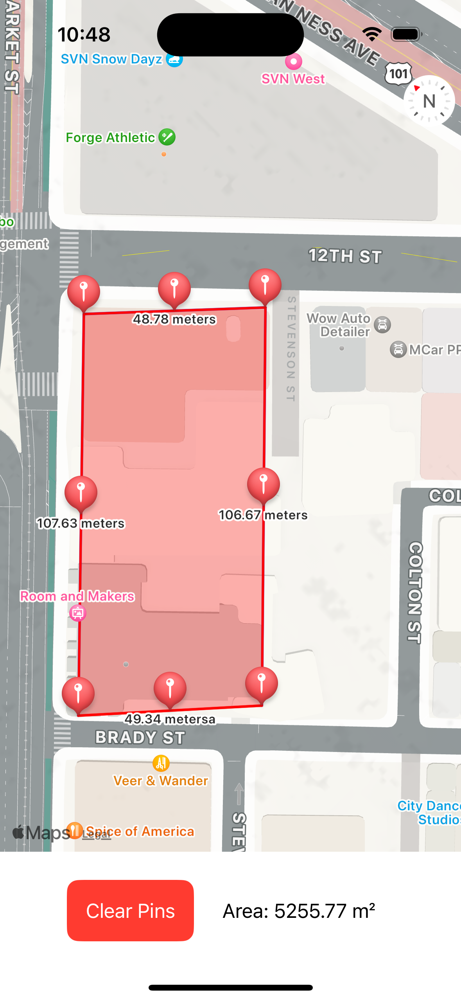

# MapViewArea

**MapViewArea** is a SwiftUI app that allows users to approximate areas on a map by placing pins. The app calculates and displays the enclosed area and distances, offering simple geospatial analysis for quick, rough measurements.

> **Note**: This project is still under construction. We welcome pull requests (PRs) for new features and improvements!



## Features

- **Pin Placement**: Users can tap on the map to place pins at specific locations, representing points of interest.
- **Area Calculation**: Once enough pins are placed (at least three), the app calculates the area enclosed by these points in square meters.
- **Distance Calculation**: The app calculates the distance between each consecutive pair of pins, as well as the distance between the first and last pin to form a closed measurement.
- **Intuitive Interface**: The app features a simple interface that allows users to view the map with the pins and calculated distances/areas in real-time.
- **Dynamic Updates**: Every time a new pin is placed, area and distance calculations are updated automatically.

## Technologies and Frameworks

- **SwiftUI**: Used for building the user interface in a declarative manner.
- **MapKit**: Used for map integration and geospatial calculations.
- **CoreLocation**: Provides location-based services, such as obtaining the user's current location and handling geospatial data.


## Planned Features

The app is still in development, and we have a roadmap for future features, including:

- **Save Areas**: Ability to save drawn areas for later reference.
- **Satellite Map View**: Change the map's view to satellite mode for better visualization.
- **Pin Dragging**: Allow users to drag the pins to new locations, automatically updating the area and distances.


## Contributing

This project is still under construction, and we welcome contributions! If you have an idea or fix, feel free to open a pull request (PR). Here's how you can contribute:

1. Fork this repository.
2. Create a new branch for your feature:
   ```bash
   git checkout -b feature/new-feature
   ```
3. Make your changes and commit them
    ```bash
   git commit -am 'Added new feature'
   ```
4. Push your branch:
    ```bash
   git push origin feature/new-feature
   ```
5. Create a Pull Request.

